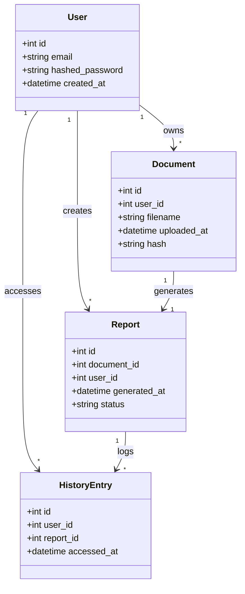

# Database Schema

```mermaid
classDiagram
    class User {
        +int id
        +string email
        +string hashed_password
        +datetime created_at
    }
    class Document {
        +int id
        +int user_id
        +string filename
        +datetime uploaded_at
        +string hash
    }
    class Report {
        +int id
        +int document_id
        +int user_id
        +datetime generated_at
        +string status
    }
    class HistoryEntry {
        +int id
        +int user_id
        +int report_id
        +datetime accessed_at
    }
    User "1" --> "*" Document : owns
    User "1" --> "*" Report : creates
    Document "1" --> "1" Report : generates
    User "1" --> "*" HistoryEntry : accesses
    Report "1" --> "*" HistoryEntry : logs
```

This diagram reflects the SQLite dev schema and the Supabase PostgreSQL production schema (identical tables, different back‑ends).
