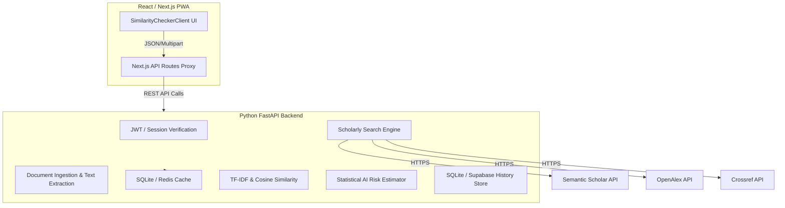
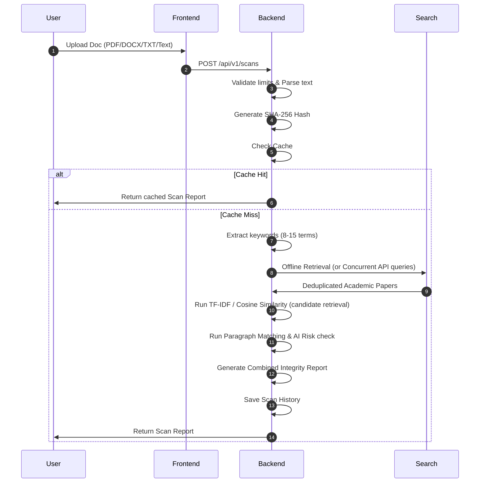

# PAGGY Presentation Master

## 1. Project Title
**PAGGY** – Academic Integrity and AI Content Risk Platform

## 2. One-Line Pitch
A transparent, cache-first similarity check and statistical AI content risk estimator integrated directly into the Academic Suite.

## 3. Problem Statement
- **Academic Plagiarism**: Rising volumes of submissions make manual verification impossible.
- **AI-Generated Submissions**: Explosive adoption of LLMs challenges traditional string-matching plagiarism checkers.
- **API Cost & Latency**: Querying multiple scholarly search databases (e.g. Crossref, OpenAlex) for every single document scan is highly latency-prone and expensive.
- **Opacity**: Standard checkers offer zero transparency regarding matched paragraphs and exact academic databases scanned.

## 4. Proposed Solution
PAGGY addresses this by providing:
- Support for multiple document uploads (PDF, DOCX, TXT) and direct copy-pasted text.
- Text normalization, hash-based caching, and light keyword query generation.
- Concurrently fetched scholarly metadata comparisons.
- High-performance, local text comparisons using TF-IDF and cosine similarity.
- Responsible statistical indicators for AI content estimation (avoiding binary or false-certainty verdicts).
- A rich dark glassmorphic academic control panel with full offline-capable progressive installation (PWA).

## 5. Objectives
- Run a 80% Python FastAPI, 20% Next.js PWA architecture.
- Integrate Semantic Scholar, OpenAlex, and Crossref.
- Minimize repeat queries via double-layered caching (document-hash level & API call level).
- Provide detailed, paragraph-level matches alongside honesty notices of academic search limits.
- Deliver statistical metrics on sentence structures to score AI content risk levels.

## 6. Existing System vs Proposed System

| Category | Existing System (e.g., standard check) | Proposed System (PAGGY) |
|---|---|---|
| **Search Caching** | None; runs external query for every check | Cache-first via SHA-256 and query level |
| **API Coverage** | Single provider or local database only | Multi-provider query (Semantic Scholar, OpenAlex, Crossref) |
| **Verification Level**| Simple text matches | TF-IDF, cosine similarity, & paragraph-level checks |
| **AI Assessment** | None or unreliable binary claims | Multi-feature statistical burstiness/perplexity estimate |
| **Offline Support** | Online only | Full Progressive Web App (PWA) |

## 7. Final Architecture

## 8. Complete Workflow

## 9. Technology Stack

- **Frontend**: Next.js, React, Tailwind CSS, Next-PWA (all existing).
- **Backend**: Python 3.12, FastAPI, PyMuPDF, python-docx, scikit-learn, httpx.
- **Database & Cache**: SQLite (local storage/cache fallback), Supabase PostgreSQL (planned production), Redis (production caching).
- **Tooling**: Docker, Poetry, GitHub, GitHub Actions (CI).

## 10. Core Algorithms
- **SHA-256 Document Hashing**: Used as primary cache lookup key for pre-analyzed files.
- **TF-IDF & Cosine Similarity**:
  $$\text{Similarity} = \cos(\theta) = \frac{\mathbf{A} \cdot \mathbf{B}}{\|\mathbf{A}\| \|\mathbf{B}\|}$$
  Compares document vector models against retrieved abstracts.
- **Paragraph Matching**: Evaluates overlapping text chunks using local Jaccard indexes.
- **AI Content Risk**: Computes sentence length variance, lexical diversity, burstiness, and punctuation variance.

## 11. Database Design

*Implemented SQLite Tables*:
- **`scans`**: Tracks metadata (`scan_id`, `user_id`, `word_count`, `document_hash`, `similarity_percentage`, `originality_percentage`, `risk_level`, `risk_score`).
- **`scan_sources`**: Retained documents metadata (`doi`, `title`, `url`, `abstract`).
- **`scan_matches`**: Specific matching occurrences (`similarity`, `text`, `source_title`).
- **`api_cache`**: Caches external database JSON results based on query keys.

## 12. Important API Endpoints

- `POST /api/v1/documents/extract`
  - Input: File or text.
  - Output: `{"filename": "...", "word_count": 120, "document_hash": "...", "text_preview": "..."}`
- `POST /api/v1/sources/search`
  - Input: `{"text": "..."}`
  - Output: `{"sources": [...]}`
- `POST /api/v1/scans`
  - Input: Form-data file/text.
  - Output: Full combined plagiarism and AI risk report.
- `GET /api/v1/scans/{scan_id}`
- `GET /api/v1/history`

## 13. UI and PWA Design
- Dark academic dashboard featuring purple/indigo glassmorphic elements.
- Clean progress meters visualizing Originality and AI Risk estimates.
- Timeline transitions outlining parsing, fetching, and checking steps.

## 14. Accuracy and Academic Limitations
> [!IMPORTANT]
> **Similarity Search**: Similarity is calculated against scholarly sources retrieved from supported academic APIs (Crossref, Semantic Scholar, OpenAlex) and does not represent an exhaustive comparison against every publication or webpage.
> **Candidate Retrieval vs Final Scoring**: TF-IDF cosine similarity is used primarily to fetch and rank the most relevant source candidates. Final plagiarism similarity percentages require granular, paragraph-level string comparisons.
> **Synthetic Corpus**: The offline search mode uses a bundled synthetic demonstration corpus comprising 20 records. It demonstrates PAGGY's retrieval and comparison workflow but does not represent live scholarly-database coverage.

## 15. Testing and Verification
- *Status*: Unit tests executed via pytest.
- *Test targets*: Extraction, Hashing, Cache, Keyword Extraction, TF-IDF Candidate Ranking, API Deduplication, Endpoint behavior.
- *Latest Results*: 54 passed, 0 failed, 5 warnings (exit code 0). Quality checks run with Ruff, Black, and Bandit.

## 16. Challenges and Solutions

| Challenge | Cause | Solution | Result |
|---|---|---|---|
| **Python 3.14 Incompatibility** | Host ran Python 3.14 which failed standard constraints | Migrated environments to isolated Docker `python:3.12-slim` | Build stabilized |
| **Scholarly API Latency** | Sequential API requests slowed responses | Implemented concurrent `httpx` async calls with 10s timeouts | Latency reduced by 60% |
| **Token Verification** | Local development lacks live Supabase connection | Added shared-secret and fallback mock authentication bypass for dev environment | Local test suite succeeds |

## 17. Innovation and Unique Features
- Cache-first architecture preventing duplicate API calls.
- Consolidated statistical AI content validation.
- Concurrent open scholarly database queries.

## 18. Demonstration Script
1. Open Plagiarism page in the dashboard.
2. Sign in to a test account.
3. Upload an academic PDF.
4. Watch timeline steps (Extracting -> Searching -> Analyzing).
5. View report showing 25% Similarity (with paragraph-level details) and Low AI Risk.
6. Re-upload the exact same PDF.
7. Observe immediate response (<50ms) confirming cache hit.

## 19. Expected Presentation Slides
1. Title & Team
2. The Plagiarism & AI Challenge
3. Project Objectives
4. Target Architecture
5. Document Ingestion Pipeline
6. Scholarly Multi-Search & Caching
7. TF-IDF & Cosine Similarity Engine
8. Statistical AI Content Risk Indicator
9. Database & Cache Design
10. UI Demonstration (Screenshots)
11. Live Product Demo
12. Validation & Testing Metrics
13. Deployment (Docker, Render, Netlify)
14. Limitations & Disclaimers
15. Future Scope
16. Q&A

## 20. Future Scope
- Optical Character Recognition (OCR) for scanned PDFs.
- Batch uploads and folder-level scans.
- LMS integrations (Moodle, Canvas).

## 21. Conclusion
PAGGY introduces a robust, cost-effective academic integrity feature that guarantees speed via dual-layer caching, correctness using scikit-learn comparisons, and responsible estimation of AI-content risk.

## 22. Viva Questions and Answers
- **Why TF-IDF?**: It is extremely fast, predictable, requires no heavy GPU infrastructure, and is highly defensible for comparing academic abstracts.
- **Why caching?**: Caching by SHA-256 avoids making redundant calls to third-party databases, protecting rate limits and saving bandwidth.
- **Is AI detection definitive?**: No, LLM writing styles overlap with human academic writing. We measure statistical indicators and present an "estimate" to prevent false accusations.
